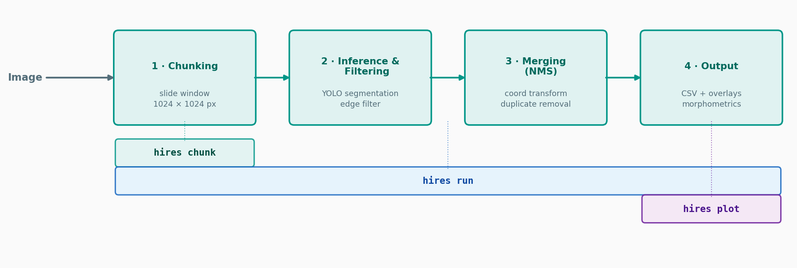

# Pipeline

HiReS processes each image through four sequential stages. This page describes each stage in detail, including the coordinate transformations and filtering logic.

---

## Workflow overview

The diagram below shows which pipeline stages each CLI command executes.



`hires plot` skips inference — it reads an existing `.txt` annotation produced by `hires run` and regenerates the overlay image without re-running segmentation.

| Command | Stages | Input | Output |
|---------|--------|-------|--------|
| `hires run` | 1 → 2 → 3 → 4 | Image or directory + model weights | CSV traits, `.txt` annotations, overlays |
| `hires chunk` | 1 only | Image or directory | Tile PNGs |
| `hires plot` | 4 only | Image + pre-existing `.txt` + model weights | Overlay image |

---

## Stage 1 — Chunking

The full-resolution image is partitioned into a regular grid of overlapping tiles using a sliding-window approach.

**Default parameters:** 1024 × 1024 px tiles with 150 px overlap.

The stride of the sliding window equals `chunk_size + overlap`, so adjacent tiles share an overlapping border region. This overlap is essential: organisms located near tile boundaries remain fully visible in at least one tile and are never represented solely as truncated detections.

If a tile extends beyond the image boundary, the out-of-bounds area is filled with zero-intensity (black) pixels to maintain a fixed tile size for consistent model input.

Each tile is saved with its top-left pixel offset encoded in the filename:

```
{base}_{x}_{y}.png
```

where `x` and `y` are absolute pixel coordinates in the original image. These offsets are used in Stage 3 to reconstruct full-image coordinates.

---

## Stage 2 — Inference & Filtering

Each tile is processed independently by the YOLO instance segmentation model. Predictions are written in YOLO segmentation format:

```
<class_id>  x1 y1  x2 y2  ...  xN yN  [confidence]
```

Polygon vertices are expressed in **tile-normalized coordinates** (values between 0 and 1 relative to the tile dimensions).

### Edge filter

Because objects intersecting tile boundaries produce truncated polygons, HiReS applies a geometry-based edge filter at the tile level. A polygon is retained only if **all vertices lie within a slightly inset unit square** defined by a small inward buffer (default `edge_threshold = 1×10⁻²`):

```
safe_box = box(0, 0, 1, 1).buffer(-edge_threshold)
polygon retained  ⟺  safe_box.contains(polygon)
```

This removes detections that touch or cross tile borders and therefore lack biological interpretability. A second edge filter is applied at the full-image level after coordinate unification (below) to remove residual border-touching detections from padded images.

---

## Stage 3 — Merging (NMS)

Retained polygons from all tiles are transformed from tile-local coordinates into global full-image coordinates, then deduplicated with non-maximum suppression.

### Coordinate transformation

Three steps convert each polygon from tile-normalized to global-normalized coordinates:

**i. Denormalization** — tile-normalized coordinates → tile pixel units:

```
x_px = x_norm × chunk_width
y_px = y_norm × chunk_height
```

**ii. Offset correction** — shift into full-image pixel space using the offset parsed from the filename:

```
x_global_px = x_px + offset_x
y_global_px = y_px + offset_y
```

**iii. Global normalization** — re-normalize relative to the full image dimensions:

```
x_global_norm = x_global_px / image_width
y_global_norm = y_global_px / image_height
```

### Non-maximum suppression

After unifying all tile polygons into a single collection, polygon-level NMS removes duplicate detections that arise from overlapping tiles.

An STRtree spatial index is constructed over all polygon bounding boxes for efficient candidate lookup. For each candidate pair, polygon-level IoU is computed:

```
IoU(A, B) = area(A ∩ B) / area(A ∪ B)
```

Polygon pairs with IoU ≥ `iou_thresh` (default 0.7) are treated as duplicates; only the higher-confidence polygon is retained.

---

## Stage 4 — Output

After NMS, the final unified annotation set is used to compute morphometric descriptors and write all output files.

See [Morphometric Descriptors](morphometrics.md) for the mathematical definitions of each trait.

See [Outputs](outputs.md) for the full list of output files.

---

## Pipeline variants

HiReS exposes three pipeline classes, all inheriting from `BasePipeline`:

| Class | Stage(s) | Use |
|-------|---------|-----|
| `SegmentationPipeline` | 1 → 2 → 3 → 4 | Full end-to-end workflow |
| `ChunkingPipeline` | 1 only | Generate tiles for annotation or inspection |
| `PlottingPipeline` | 4 only | Render existing annotations without re-running inference |

---

## Debug mode

When `debug=True`, the pipeline saves per-tile annotation files to `<out>/<image>_debug/` before edge filtering. This is useful for diagnosing missed detections or NMS behaviour at the tile level.

---

## Module reference

| Module | Class / Function | Role |
|--------|-----------------|------|
| `hires/pipeline/base.py` | `BasePipeline` | Image iteration, mode detection, logging |
| `hires/pipeline/seg_pipeline.py` | `SegmentationPipeline` | Orchestrates all four stages |
| `hires/pipeline/chunk_pipeline.py` | `ChunkingPipeline`, `PlottingPipeline` | Standalone tile and plot pipelines |
| `hires/processing/chunker.py` | `ImageChunker` | Overlapping tile splitting |
| `hires/processing/predictor.py` | `YOLOSegPredictor` | YOLO inference wrapper |
| `hires/operations/ops.py` | `unify_collections()` | Coordinate transform from tile to full image |
| `hires/models/eval/iou.py` | `IoUMatrix` | Pairwise IoU computation with STRtree |
| `hires/viz/plotting.py` | `SegmentationPlotter` | Polygon overlay rendering |
| `hires/analysis/analyis.py` | — | Shape descriptor extraction and analysis |
